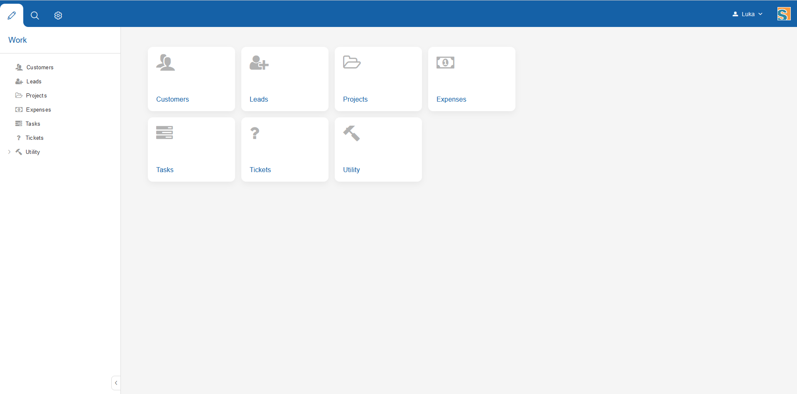

<h1 align="center">Anippe CRM</h1>

Anippe is new open source CRM project. Purpose of this project is to build PerfexCRM clone. It is built using Eclipse Scout (Java) framework and PostgreSql database

## Get started

* Download IntelliJ Community Edition
* Import project from GitHub
* In projects (anippe.server.app.dev and anippe.client.app.dev) rename config.properties.example file to config.properties
* Create empty PostgreSql database
* Edit anippe.server.app.dev config.properties file and insert your DB credentials
<pre>
### DB Connection
db.url=jdbc:postgresql://localhost:5432/anippe
db.username=postgres
db.password=mypassword
</pre>
* Run [webapp]all configuration to start server and client and build .js and .less files
* Open application on http://localhost:8082

Read more about Eclipse Scout:
https://www.eclipse.org/scout/

## Thank you, open source

Anippe uses a lot of open source projects and we thank them with all our hearts. We hope that providing Anippe as an free, open source project will help other people the same way those softwares have helped us.

## License

Copyright © 2022

Licensed under [the AGPL License](/LICENSE.md).
